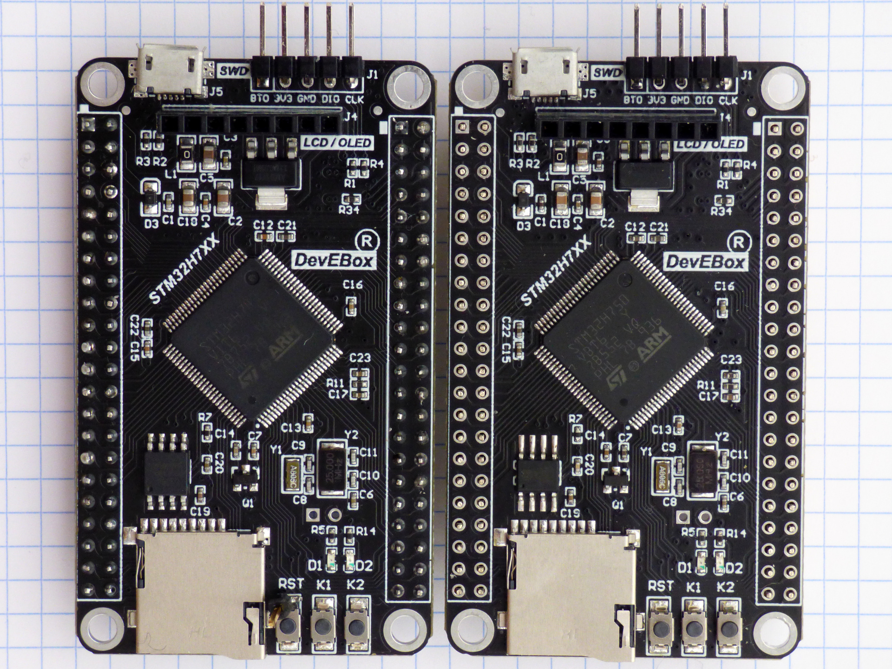
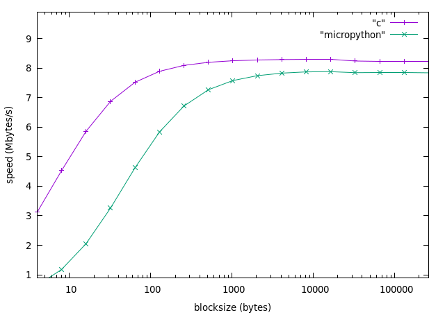

# micropython-psram
*8 megabyte ram for [openmv](http://openmv.io/)*

Project goal: Increasing STM32F7xx and STM32H7xx RAM by 8 megabyte, while increasing cost by less than $1.

[](doc/psram_mod.jpg)

Two DEVEBOX STM32H7XX boards. On the board to the right the Winbond W25Q64 SPI flash memory has been replaced with a Espressif ESP-PSRAM64H, an 8 Mbyte SPI pseudo-static RAM.

The board on the left already has a header pin soldered to the reset button. With RST, SWCLK and SWDIO broken out, connecting a debugger is easy. 

## Module
The spi ram can be accessed from micropython and from c.

From micropython:

```
import psram
psram.read(address, data)
psram.write(address, data)
```

where address is an integer, and data is `bytes()` or `bytearray()`

From c:

```
void psram_init();
void psram_read(uint32_t addr, size_t len, uint8_t *dest);
void psram_write(uint32_t addr, size_t len, const uint8_t *src);
```
Micropython use example:

```
>>> import psram
psram eid: a2525d0d 31913164
>>> addr=0
>>> src=b'abcdefgh'
>>> psram.write(addr, src)
>>> dest=bytes(8)
>>> psram.read(addr, dest)
>>> dest
b'abcdefgh'
```


## Constraints

There are constraints from the processor, and constraints from the ram.

- STM32F7xx/H7xx processor: The STM32 processor can memory-map spi ram for read access, but not for write access. This way you can run a program stored in external spi memory, but because there is no write access you cannot store the heap in external spi ram (like on ESP32)

- ESP-PSRAM64H spi ram: If a read or write stays within the same 1kbyte page maximum SPI clock speed is 144 MHz. If a read or write crosses the 1kbyte page boundary, maximum SPI clock speed is 84 MHz.

- If processor clock frequency is 216MHz, easily available SPI clock frequencies are 108MHz and 72MHz.

## Speed Measurements

This is a graph of read/write speed versus bytes read (or written).

 

Vertical axis is read/write speed in mbyte/s; horizontal axis is block size in bytes. SPI bus at 36MHz.

Read and write speed are identical.

The page size of the memory is 1Kbyte. Writing blocks larger than 1Kbyte does not increase speed much. Writing blocks smaller than 1Kbyte does cause speed to drop off.

For small writes of 4 bytes, half the time is spent writing the address, the other half writing the data. This is not efficient.

## Compiling

Add the *psram* module to the micropython sources.

In `mpconfigboard.mk` add:
```
MODULE_PSRAM_ENABLED=1
```

In `mpconfigboard.h`: set 
```
#define MICROPY_HW_HAS_FLASH        (0)
```

Remove 
```
// Winbond W25Q64 64Mbit external QSPI flash
#define MICROPY_HW_QSPIFLASH_SIZE_BITS_LOG2 (26)
#define MICROPY_HW_QSPIFLASH_CS     (pyb_pin_QSPI_BK1_NCS)
#define MICROPY_HW_QSPIFLASH_SCK    (pyb_pin_QSPI_CLK)
#define MICROPY_HW_QSPIFLASH_IO0    (pyb_pin_QSPI_BK1_IO0)
#define MICROPY_HW_QSPIFLASH_IO1    (pyb_pin_QSPI_BK1_IO1)
#define MICROPY_HW_QSPIFLASH_IO2    (pyb_pin_QSPI_BK1_IO2)
#define MICROPY_HW_QSPIFLASH_IO3    (pyb_pin_QSPI_BK1_IO3)
```

Add
```
// Espressif ESP-PSRAM64H or Lyontek LY68L6400SLIT  64Mbit external QSPI sram
#define MICROPY_MODULE_BUILTIN_INIT       (1)
#define MICROPY_HW_QSPIRAM_SIZE_BITS_LOG2 (26)
#define MICROPY_HW_QSPIRAM_CS     (pyb_pin_QSPI_BK1_NCS)
#define MICROPY_HW_QSPIRAM_SCK    (pyb_pin_QSPI_CLK)
#define MICROPY_HW_QSPIRAM_IO0    (pyb_pin_QSPI_BK1_IO0)
#define MICROPY_HW_QSPIRAM_IO1    (pyb_pin_QSPI_BK1_IO1)
#define MICROPY_HW_QSPIRAM_IO2    (pyb_pin_QSPI_BK1_IO2)
#define MICROPY_HW_QSPIRAM_IO3    (pyb_pin_QSPI_BK1_IO3)
```


## Cost

A 8 mbyte spi sram costs [1.3 USD](https://www.google.com/search?q=esp-psram64h+site%3A.aliexpress.com), quantity 1, shipping included. For comparison, a 8 mbyte spi flash costs  0.5 USD, quantity 1. (2020 prices)

## Datasheets
The following "Made in Asia" components seem to be very similar:

 - [Espressif ESP-PSRAM64H](doc/esp-psram64_esp-psram64h_datasheet_en.pdf)
 - [Lyontek LY68L6400SLIT](doc/LY68L6400SLIT.pdf) and at [lcsc](https://lcsc.com/product-detail/RAM_Lyontek-Inc-LY68L6400SLIT_C261881.html)
 - [IPS6404LSQ](doc/IPUS_64Mbit_SQPI_PSRAM.pdf)